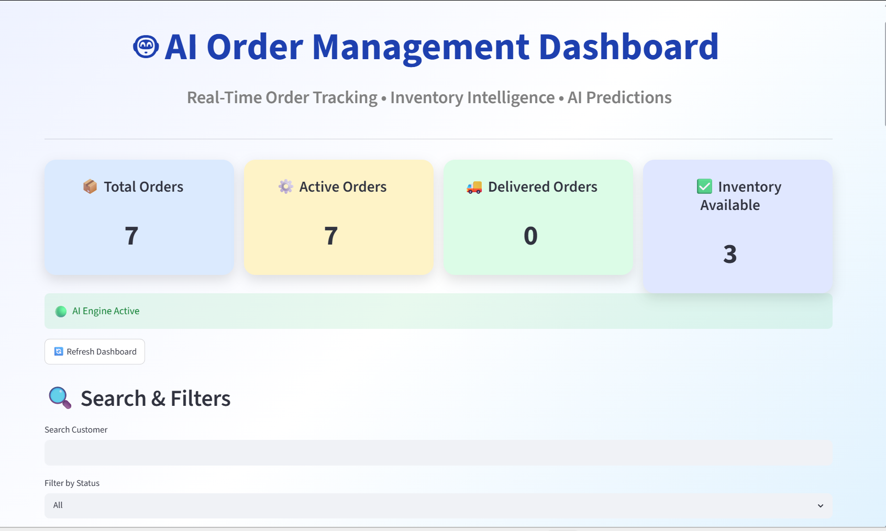
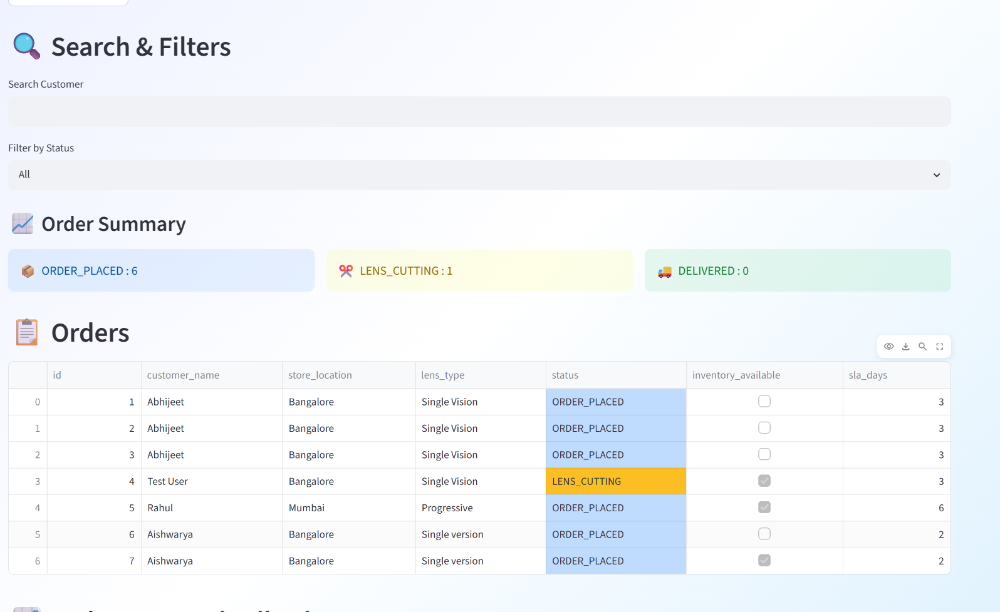
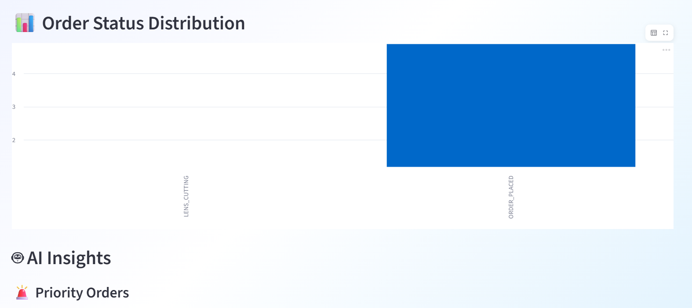
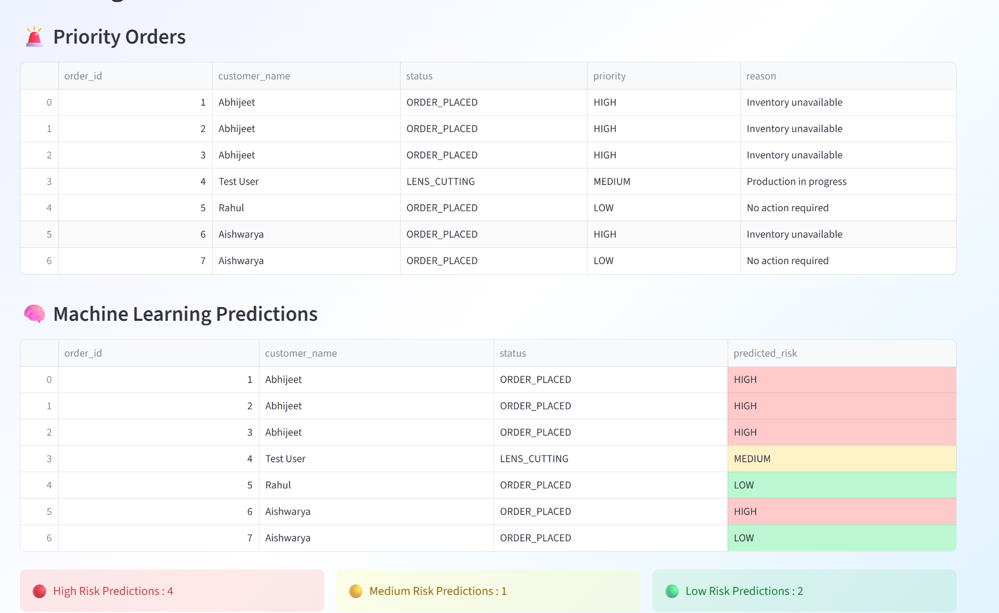
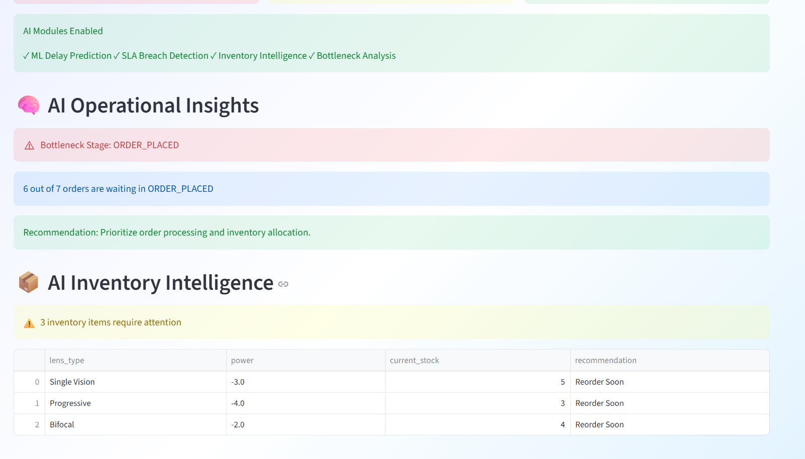
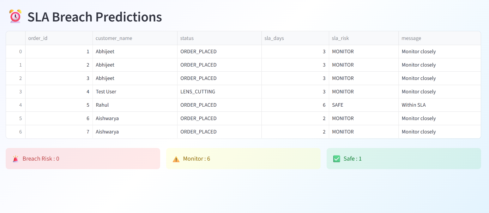

# AI-Powered Order Management System

## Overview

The AI-Powered Order Management System is a full-stack application designed for eyewear order processing. It manages the complete order lifecycle, from order creation to delivery, while providing AI-driven insights for operations teams.

The system combines FastAPI, PostgreSQL, Streamlit, and Machine Learning to automate order tracking, inventory verification, risk prediction, SLA monitoring, and operational analytics.

---

## Business Problem Solved

Eyewear orders are more complex than standard e-commerce orders. Each order contains prescription details, lens configurations, coatings, frames, inventory dependencies, and SLA commitments.

Delays can occur due to:

* Inventory shortages
* Production bottlenecks
* Manufacturing delays
* SLA breaches

This system provides operational visibility through AI-powered monitoring, helping teams prioritize orders, predict risks, manage inventory, and improve fulfillment efficiency.

---

## Key Features

### Order Management

* Create eyewear orders
* Update order status
* Track complete order lifecycle
* Store prescription details
* Monitor fulfillment progress

### Inventory Management

* Inventory verification workflow
* Inventory availability tracking
* Low stock identification
* Inventory intelligence recommendations

### AI & Machine Learning

* Random Forest-based delay prediction
* Order prioritization engine
* SLA breach prediction
* Bottleneck analysis
* Operational insights dashboard

### Dashboard

* Real-time KPIs
* Interactive order table
* Search & filtering
* Status distribution charts
* ML prediction monitoring
* Inventory intelligence view
* SLA monitoring dashboard

---

## Technology Stack

### Backend

* FastAPI
* SQLAlchemy
* PostgreSQL

### Frontend

* Streamlit

### Machine Learning

* Scikit-Learn
* Random Forest Classifier
* Pandas
* Joblib

### Database

* PostgreSQL

---

## System Architecture

```text
User
  │
  ▼
Streamlit Dashboard
  │
  ▼
FastAPI APIs
  │
  ▼
PostgreSQL Database
  │
  ▼
AI Services
  │
  ▼
Random Forest Model
```

---

## Project Structure

```text
AI_ORDER_MANAGEMENT/
│
├── backend/
│   │
│   ├── main.py
│   ├── database.py
│   ├── models.py
│   ├── schemas.py
│   ├── crud.py
│   │
│   ├── ai_service.py
│   ├── ml_predictor.py
│   ├── priority_service.py
│   ├── sla_service.py
│   ├── bottleneck_service.py
│   │
│   └── ml/
│       ├── generate_dataset.py
│       ├── train_model.py
│       ├── orders_training.csv
│       ├── model.pkl
│       ├── status_encoder.pkl
│       └── risk_encoder.pkl
│
├── frontend/
│   └── app.py
│
├── screenshots/
│   ├── dashboard.png
│   ├── orders_table.png
│   ├── order_status_distribution.png
│   ├── ml_predictions.png
│   ├── operational_insights.png
│   └── sla_monitoring.png
│
├── requirements.txt
├── README.md
│
└── venv/
```
---

## Dashboard Screenshots

### Main Dashboard



Shows:

* Total Orders
* Active Orders
* Delivered Orders
* Inventory Availability
* Search & Filters

---

### Orders & Analytics

#### Orders Table



Features:

* Order tracking
* Status monitoring
* Inventory visibility
* SLA visibility

#### Order Status Distribution



Provides a visual breakdown of order statuses across the workflow.

---

### AI Predictions



Machine Learning model predicts:

* HIGH Risk Orders
* MEDIUM Risk Orders
* LOW Risk Orders

based on:

* Inventory Availability
* Order Status
* SLA Days

---

### Operational Insights

#### Bottleneck Analysis



Identifies workflow stages where orders are accumulating and recommends operational actions.

#### SLA Monitoring



Detects orders that:

* Are within SLA
* Need monitoring
* Are at breach risk

---


## AI Features

### Delay Prediction

Predicts whether an order is at:

* HIGH Risk
* MEDIUM Risk
* LOW Risk

using a Random Forest machine learning model.

Features used:

* Inventory Availability
* Order Status
* SLA Days

---

### Inventory Intelligence

Identifies inventory shortages and recommends replenishment actions.

Example:

```text
Progressive Lens (-4.0)
Current Stock: 3
Recommendation: Reorder Soon
```

---

### SLA Monitoring

Detects orders at risk of breaching SLA commitments.

Outputs:

* SAFE
* MONITOR
* BREACH

---

### Bottleneck Analysis

Identifies workflow stages where orders are accumulating.

Example:

```text
6 out of 7 orders are waiting in ORDER_PLACED
```

Recommendation:

```text
Prioritize order processing and inventory allocation.
```

---

### Priority Engine

Automatically highlights orders requiring immediate operational attention.

Priority Levels:

* HIGH
* MEDIUM
* LOW

---

## Machine Learning Pipeline

### Dataset

* 5000 Synthetic Training Records

### Model

* Random Forest Classifier

### Workflow

```text
Dataset Generation
        │
        ▼
Model Training
        │
        ▼
Model Serialization (model.pkl)
        │
        ▼
FastAPI Prediction API
        │
        ▼
Streamlit Dashboard
```

---

## Installation & Setup

### Clone Repository

```bash
git clone <repository-url>
cd ai_order_management
```

### Create Virtual Environment

```bash
python -m venv venv
```

### Activate Virtual Environment

Windows:

```bash
venv\Scripts\activate
```

Linux/Mac:

```bash
source venv/bin/activate
```

### Install Dependencies

```bash
pip install -r requirements.txt
```

### Start FastAPI Server

```bash
uvicorn backend.main:app --reload
```

FastAPI Swagger UI:

```text
http://127.0.0.1:8000/docs
```

### Start Streamlit Dashboard

```bash
streamlit run frontend/dashboard.py
```

Dashboard URL:

```text
http://localhost:8501
```

---


## API Endpoints

### Order APIs

```http
POST /orders
```

Create a new order.

```http
GET /orders
```

Retrieve all orders.

```http
PUT /orders/{id}/status
```

Update order status.

```http
PUT /orders/{id}/inventory
```

Update inventory availability.

---

### Dashboard APIs

```http
GET /dashboard
```

Retrieve dashboard KPIs.

---

### AI APIs

```http
GET /ai/predictions
```

Machine Learning risk predictions.

```http
GET /ai/priorities
```

Priority order recommendations.

```http
GET /ai/inventory-recommendations
```

Inventory intelligence insights.

```http
GET /ai/sla-predictions
```

SLA monitoring results.

```http
GET /ai/bottlenecks
```

Operational bottleneck analysis.

---

## Future Enhancements

### Advanced Machine Learning

- XGBoost-based Delay Prediction Model
- Model Performance Comparison (Random Forest vs XGBoost)
- Automated Hyperparameter Tuning
- Demand Forecasting using Time Series Models

### Generative AI Features

- GenAI-powered Order Support Assistant
- RAG (Retrieval-Augmented Generation) Chatbot for Order Queries
- Natural Language Search for Orders and Inventory
- AI-generated Operational Summaries

### Vector Database Integration

- Store Order Knowledge Base using Vector Embeddings
- Semantic Search across Orders, Inventory, and SOP Documents
- Integration with ChromaDB, Pinecone, or FAISS
- Similar Order Retrieval using Embedding Search

### Operations & Analytics

- Real-Time Notifications
- Advanced SLA Forecasting
- Production Scheduling Optimization
- Inventory Demand Prediction

### Platform Enhancements

- Docker Deployment
- User Authentication & Role-Based Access
- Cloud Deployment (AWS/GCP/Azure)
- CI/CD Pipeline Integration

## Author

**Aishwarya Hosurmath**
